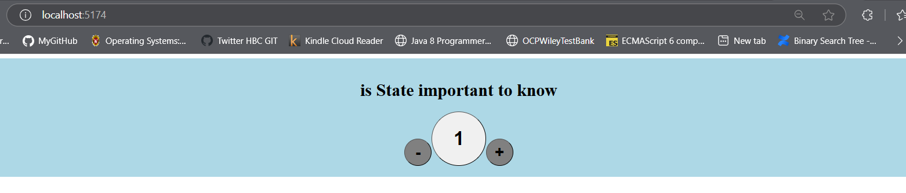

# First React State Project
React app to learn React State

## Table of contents
- [Overview](#overview)
    - [Challenge](#challenge)
    - [Screenshot](#screenshot)
- [How to Run](#how-to-run)
- [My Process](#my-process)
    - [Built With](#built-with)
    - [What I Learned](#what-i-learned)
- [Author](#author)
- [Acknowledgments](#acknowledgments)

## Overview

### Challenge
Understand React State for dynamic React apps render. Create a simple counter which can be used to either increament or decreament the displayed number

### Screenshot


## How to Run
1. Local
```sh
    npm i
    npm run dev
```
2. Check the deployed version

Live Site Url [Mayank's Git hub pages]()

## My Process

### Built with
- React 19.1.0
- Vite 6.3.5

### What I Learned

1. Any React Component has props and state
2. Props can be passed from outside to react component
3. Props are immutable in nature
4. State is local to a component
5. Any change in state leads to re-render of the corresponding component
6. We create state using below syntax
    ```jsx
    const [count,setCount] = React.useState(0);
    ```
    Here count is a state variable and setCount is the setter method. count is being initialized with 0
7. Updating State variable
    ```jsx
    function increament(){
        setCount(prevCount => prevCount + 1);
    }
    ```
    OR
    ```jsx
    function increament(){
        setCount(count + 1);
    }
    ```
    setter function can accept the value to be set or it can accept a callback function.
    The callback function has an advantage, that it gets the previous State value as parameter. Any state change which depend on previous state, hence need to updated via callback function only
8. Used z-index and -(ve) margin property to super impose an html element over another
    ```jsx
    <button id='plusBtn' style={{ borderRadius: "50%", width: "50px", height: "50px", fontSize: "30px", 
            fontWeight: "bold",backgroundColor: "grey" , position: "relative", zIndex: 2 ,marginRight: "-20px"}}
            onClick={increament}>
          +
        </button>
    ```
## Author
Mayank Madhav

## Acknowledgments
Free Code Camp Org.
React Tutorial by Bob Ziroll [Youtube content link](https://www.youtube.com/watch?v=x4rFhThSX04&t=8394s)
